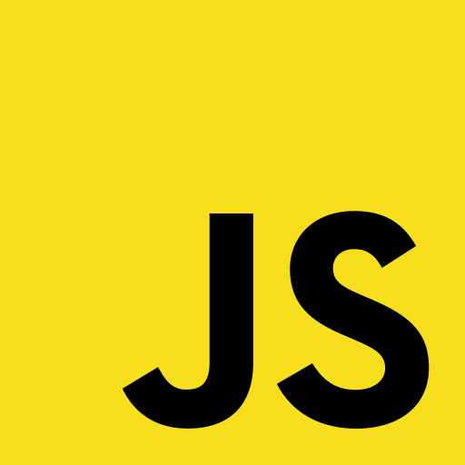
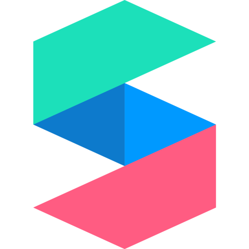
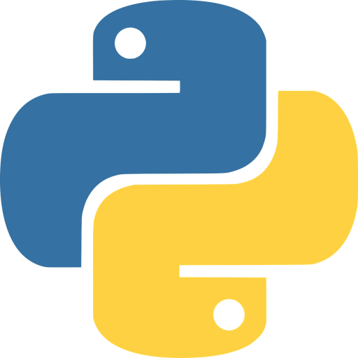

<h1 align="center">${\Huge\color{lightpink}\bf HenIsTheMan, \thinspace \color{skyblue} isn't \space he?}$</h1>

<h6></h6>

<h1 align="center"><samp>🖥️ ${\large\color{#AA77EE}\oldstyle \negthinspace Coding/Programming \negthinspace}$ 🖥️</samp></h1>

	
<strong>ℹ️ The Past 📽📽</strong>

	

	

		<code></code>
		<code></code>
		<code></code>
		<code></code>
		<code></code>
		<code></code>
		<code></code>
		<code></code>
		<code></code>
		<code></code>
		<code></code>
	

	
<strong>ℹ The Present 🎁🎁</strong>

	

	

		<code></code>
		<code></code>
		<code></code>
		<code></code>
		<code></code>
		<code></code>
		<code></code>
		<code></code>
		<code></code>
	

	
<strong>ℹ️ The Future ❔❓</strong>

	

	

		<code></code>
		<code></code>
		<code></code>
		<code></code>
		<code></code>
		<code></code>
		<code></code>
	

<h6></h6>

<h4 align="center">${\large\cal \color{lightpink}A \negthinspace\space \color{skyblue}E \color{#AA77EE}J}$</h4>

${\normalsize\tt\color{rgb(100, 100, 100)} A \space\thinspace contract \space\thinspace is \space\thinspace a \space\thinspace contract \space\thinspace is \space\thinspace a \space\thinspace contract}$
