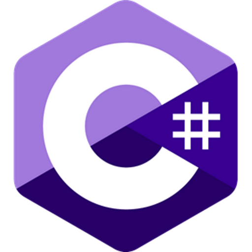

<h4>

	
ℹ️ <strong>The Past</strong> 🦕🦖🕰️🏛️

	

	

		<code><kbd></kbd></code>
		<code><kbd></kbd></code>
		<code><kbd></kbd></code>
		<code><kbd></kbd></code>
		<code><kbd></kbd></code>
		<code><kbd></kbd></code>
		<code><kbd></kbd></code>
		<code><kbd></kbd></code>
		<code><kbd></kbd></code>
		<code><kbd></kbd></code>
		<code><kbd></kbd></code>
	

	
ℹ <strong>The Present</strong> 🎁💗💙💜🎁

	

	

		<code><kbd></kbd></code>
		<code><kbd></kbd></code>
		<code><kbd></kbd></code>
		<code><kbd></kbd></code>
		<code><kbd></kbd></code>
		<code><kbd></kbd></code>
		<code><kbd></kbd></code>
		<code><kbd></kbd></code>
		<code><kbd></kbd></code>
		<code><kbd></kbd></code>
		<code><kbd></kbd></code>
		<code><kbd></kbd></code>
	

</h4>

<kbd></kbd>

<h4 align="center"><kbd>$\LARGE\cal \color{lightpink}A \color{skyblue}E \color{#AA77EE}J$</kbd></h4>

<samp>A contract is a contract is a contract</samp>

$\tt\color{rgb(100, 100, 100)}
	\scriptsize\textcopyright \space \normalsize HenIsTheMan
$
