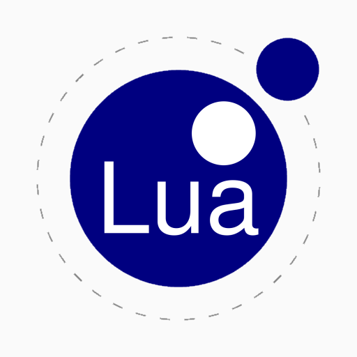
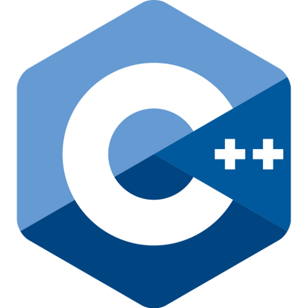
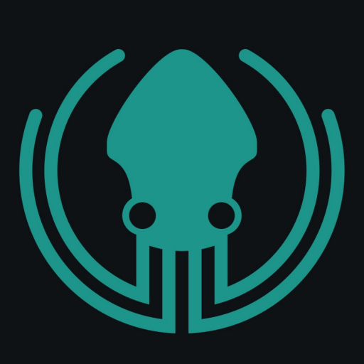

<h1 align="center"><h1 align="center">$\Huge\color{lightpink}\bf HenIsTheMan, \thinspace \color{skyblue} isn't \space he?$</h1></h1>

<h6></h6>

<h1 align="center"><samp>🖥️ $\large\color{#AA77EE}\oldstyle \negthinspace Coding/Programming \negthinspace$ 🖥️</samp></h1>

	
ℹ️ <strong>The Past</strong> 🦕🦖

	

	

		<code><kbd></kbd></code>
		<code><kbd></kbd></code>
		<code><kbd></kbd></code>
		<code><kbd></kbd></code>
		<code><kbd></kbd></code>
		<code><kbd></kbd></code>
		<code><kbd></kbd></code>
		<code><kbd></kbd></code>
		<code><kbd></kbd></code>
		<code><kbd></kbd></code>
		<code><kbd></kbd></code>
	

	
ℹ <strong>The Present</strong> 🥰🐤

	

	

		<code><kbd></kbd></code>
		<code><kbd></kbd></code>
		<code><kbd></kbd></code>
		<code><kbd></kbd></code>
		<code><kbd></kbd></code>
		<code><kbd></kbd></code>
		<code><kbd></kbd></code>
		<code><kbd></kbd></code>
		<code><kbd></kbd></code>
		<code><kbd></kbd></code>
		<code><kbd></kbd></code>
		<code><kbd></kbd></code>
	

&nbsp;

<kbd></kbd>

<h4 align="center"><kbd>$\LARGE\cal \color{lightpink}A \negthinspace\space \color{skyblue}E \color{#AA77EE}J$</kbd></h4>

$\tt\color{rgb(100, 100, 100)}
	\scriptsize\textcopyright\normalsize \space HenIsTheMan \space\thinspace
	(A \space\thinspace contract \space\thinspace is \space\thinspace a \space\thinspace contract \space\thinspace is \space\thinspace a \space\thinspace contract)
$
